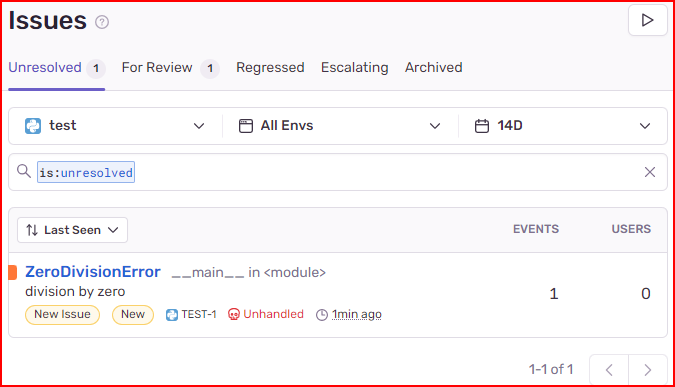

## Longhorn
Longhorn is a full storage manager to Kubernetes including:
- Automatic replication
- External volume backup and snapshots in S3 or NFS
- Dashboard to check all volume and related metadata
- Consistence checks throught CronJobs

Be careful:
- All volumes are created in cluster nodes, sou we are using our aplication cluster to a storage cluster.

### Instalation
Considering installation processing in a Kubernetes 1.24 cluster running over Debian 11 nodes.

Run in all nodes:
```bash
apt install -y open-iscsi nfs-common
apt install -y jq
which bash curl findmnt grep awk blkid lsblk
```
Run in master:
```bash
kubectl apply -f https://raw.githubusercontent.com/longhorn/longhorn/v1.4.0/deploy/longhorn.yaml
NODE_IP=192.168.1.252
kubectl -n longhorn-system patch service/longhorn-frontend -p '{"spec": {"externalIPs": ["'$NODE_IP'"]}}'
kubectl -n longhorn-system get pod,service
```
Check in [https://longhorn.io/docs](https://longhorn.io/docs) the desired version.

### Tests and Usage
To begin the tests I will sugest

**longhorn-pvc.yaml**
```yaml
apiVersion: v1
kind: PersistentVolumeClaim
metadata:
  name: longhorn-pvc
spec:
  storageClassName: longhorn
  accessModes:
    - ReadWriteMany
  resources:
    requests:
      storage: 50Mi
```

**longhorn-pod.yaml**
```yaml
apiVersion: v1
kind: Pod
metadata:
  labels:
    app: longhorn-test
  name: longhorn1
spec:
  volumes:
  - name: longhorn
    persistentVolumeClaim:
      claimName: longhorn-pvc
  containers:
  - image: debian
    name: debian
    args:
    - bash
    - '-c'
    - sleep 1d
    volumeMounts:
    - name: longhorn
      mountPath: /mnt/longhorn
```

Apply and check:
```bash
kubectl apply -f
kubectl get pv,pvc,pod
kubectl exec -it longhorn1 -- bash -c 'echo DATA: $(date) "|" HOSTNAME: $HOSTNAME > /mnt/longhorn/$HOSTNAME.txt'
kubectl exec -it longhorn1 -- bash -c 'cat /mnt/longhorn/*.txt'
```
Create another pods by changing name in YAML file and create files from pods with different names.

### Web Interface
Now let's explore Longhorn's web inteface.


## Kubernetes ServiceAccount for port-forward

Create ServiceAccount: 

```yaml
apiVersion: v1
kind: ServiceAccount
metadata:
  name: port-forward-to-internal-service
  namespace: internal-service
```

Create Role:

```yaml
apiVersion: rbac.authorization.k8s.io/v1
kind: Role
metadata:
  name: port-forward-to-internal-service
  namespace: internal-service
rules:
  - apiGroups: [""]
    resources: ["services"]
    resourceNames: ["internal-service"] # Service's name
    verbs: ["get"]
  - apiGroups: [""]
    resources: ["pods"]
    verbs: ["list","get"]
  - apiGroups: [""]
    resources: ["pods/portforward"]
    verbs: ["create"]
```

Create RoleBinding:

```yaml
apiVersion: rbac.authorization.k8s.io/v1
kind: RoleBinding
metadata:
  name: port-forward-to-internal-service
  namespace: internal-service
subjects:
  - kind: ServiceAccount
    name: port-forward-to-internal-service
    namespace: internal-service
roleRef:
  kind: Role
  name: port-forward-to-internal-service
  apiGroup: rbac.authorization.k8s.io
```

Apply all manifests.

Check if they are correct applyed:

```bash
k -n internal-sercice get sa/port-forward-to-internal-sercice \
        role/port-forward-to-internal-sercice \
        rolebinding/port-forward-to-internal-sercice
```

Export kubeconfig to this service account:

```bash
cat <<EOF > port-forward-config.yaml
apiVersion: v1
kind: Config
clusters:
- name: aks
  cluster:
    server: "$(kubectl config view --minify --flatten -o jsonpath='{.clusters[0].cluster.server}')"
    insecure-skip-tls-verify: true
users:
- name: port-forward-to-internal-service
  user:
    token: "$(kubectl -n internal-service create token port-forward-to-internal-service --duration=96m)"
contexts:
- name: limited-context
  context:
    cluster: aks
    user: port-forward-to-internal-service
    namespace: internal-service
current-context: limited-context
EOF
cat port-forward-config.yaml
```

How to use:

```bash
kubectl --kubeconfig C:\Users\cmausersparkproxy\port-forward-config.yaml port-forward -n internal-service svc/internal-service 10000:10000
```

- This service account will be able to list all containers inside this namespace. Do not include other services or containers inside this namespace to avoid expose more information than needed.

## Kubernetes Dashboard (deprecated)
Kubernetes Dashboard is the official Kubernetes pannel to visualize Kubernetes resources.
Instalation:
```bash
kubectl apply -f https://raw.githubusercontent.com/kubernetes/dashboard/v2.7.0/aio/deploy/recommended.yaml
k -n kubernetes-dashboard get all,secret,cm
 ```
Patch service to External IP:
```bash
k -n kubernetes-dashboard patch service/kubernetes-dashboard -p '{"spec": {"externalIPs": ["172.26.28.36"]}}'
```
Patch service to change TCP port:
```bash
k -n kubernetes-dashboard patch service/kubernetes-dashboard --type=json -p='[{"op":"replace","path":"/spec/ports/0/port","value":9443}]'
```
Create user:
```bash
echo "apiVersion: v1
kind: ServiceAccount
metadata:
  name: admin-user
  namespace: kubernetes-dashboard
" | k -n kubernetes-dashboard apply -f -
echo "apiVersion: rbac.authorization.k8s.io/v1
kind: ClusterRoleBinding
metadata:
  name: admin-user
roleRef:
  apiGroup: rbac.authorization.k8s.io
  kind: ClusterRole
  name: cluster-admin
subjects:
- kind: ServiceAccount
  name: admin-user
  namespace: kubernetes-dashboard
" | k -n kubernetes-dashboard apply -f -
kubectl -n kubernetes-dashboard create token admin-user
```
Take note of generated token.
Access service:
```bash
https://172.26.28.36:9443/
```
- Accept certificate.
- Paste token.

```bash
eyJhbGciOiJSUzI1NiIsImtpZCI6Im9TZ2dVUk1LeGtWekctQlQ0bHJoLU1obVo0ei1aZ2wtQ0x2NWNpMXpFSGcifQ.EditedTokenEditedTokenEditedTokenEditedTokenEditedTokenEditedTokenEditedTokenEditedTokenEditedTokenEditedTokenEditedTokenEditedTokenEditedTokenEditedTokenEditedTokenEditedTokenEditedTokenEditedTokenEditedTokenEditedTokenEditedTokenEditedTokenEditedTokenEditedTokenEditedTokenEditedTokenEditedTokenEditedTokenEditedTokenEditedTokenEditedTokenEditedTokenEditedTokenEditedTokenEditedTokenEditedTokenEditedTokenEditedTokenEditedTokenEditedTokenEditedTokenEditedTokenEditedTokenEditedTokenEditedTokenEditedTokenEditedTokenEditedTokenEditedTokenEditedTokenEditedTokenEditedTokenEditedTokenEditedTokenEditedTokenEditedTokenEditedTokenEditedTokenEditedTokenEditedTokenEditedTokenEditedTokenEditedTokenEditedTokenEditedTokenEditedTokenEditedTokenEditedTokenEditedTokenEditedTokenEditedTokenEditedTokenEditedTokenEditedTokenEditedTokenEditedTokenEditedTokenEditedTokenEditedTokenEditedTokenEditedTokenEditedTokenCyWqFnucl8GeB4Y-d8_AXNBcajUGKKh_-FKoCm3iULuVOhzZIKwvcglWRCNvPeUnNPxVfq4tGvMGl552mkXOgjg
```

## Headlamp

Kubernetes dashboard was deprecated and the recommended replacement is **Headlamp**. It has two modes: `in-cluster` and `desktop`.

#### Headlamp in-cluster

Create Headlamp service account and token:

```bash
kubectl -n kube-system create serviceaccount headlamp-admin
kubectl create clusterrolebinding headlamp-admin \
    --serviceaccount=kube-system:headlamp-admin \
    --clusterrole=cluster-admin
kubectl -n kube-system create token headlamp-admin
```

Run Headlamp components:

```bash
kubectl apply -f https://raw.githubusercontent.com/kubernetes-sigs/headlamp/main/kubernetes-headlamp.yaml
kubectl -n kube-system get sa,secret,service,deployment,po|grep headlamp
```

Access Headlamp:

```bash
kubectl -n kube-system get secret headlamp-admin -o jsonpath='{.data.token}'|base64 -d
# Copy access token
kubectl -n kube-system port-forward service/headlamp 8080:80
```

Remove Headlamp:

```bash
kubectl -n kube-system delete deployment.apps/headlamp
kubectl -n kube-system delete secret/headlamp-admin
kubectl -n kube-system delete service/headlamp
kubectl -n kube-system delete token headlamp-admin
kubectl delete clusterrolebinding headlamp-admin
kubectl -n kube-system delete serviceaccount headlamp-admin
```

#### Headlamp local (Linux)

Download, install and run:
```bash
wget https://github.com/kubernetes-sigs/headlamp/releases/download/v0.39.0/headlamp_0.39.0-1_amd64.deb
sudo dpkg -i headlamp_0.39.0-1_amd64.deb
headlamp
```

Remove:
```bash
sudo apt remove --purge headlamp
```

#### Headlamp with AI assist (Ollama)

- Prerequisites:
  - Local installation of Ollama version 0.14.1 (using WSL)
      - Some models did not work with version 0.11.11
  - Local installation of HeadLamp (for Windows)
  - Kubernetes cluster (using K3S inside WSL)

- Run Ollama Model
```bash
ollama run --experimental ministral-3:3b
    /bye
```

- Best experience:
  - gemini-2.5-flash (SaaS): excelent, little slow

Not a good model, but it works:
- ministral-3:3b: slow, the best local model, but with some empty answers

Works sometimes, but fails more than succeed:
- qwen3:4b (slow, right answers, empty answers)
- qwen2.5-coder:3b (wrong answers without tools, empty answers with tools)
- phi4-mini:latest (wrong answers)
- llama3.2:latest (wrong answers without tools, empty answers with tools)

Models that did not work:
- qwen3-vl:4b (slow, without response)
- codegemma:2b (error)
- starcoder2:7b (error)
- deepseek-coder:6.7b (error)
- codellama:7b (error)
- qwen2.5vl:3b (error)
- gemma3:4b (error)
- smallthinker:latest (error)
- cogito:3b (error)
- granite4:3b (empty answers)
- deepseek-r1:1.5b (error)
- gemini-2.5-pro (SaaS) (error, slow)

From local models with 4GB of VRAM size, the best was `ministral-3:3b`. Try to find models with `tools` tag smaller than your VRAM.

- Open Headlamp:
    - Home > All Clusters > Add cluster > Load from KubeConfig > Point to your file > Next > Finsh
        - > I changed the IP address inside `~/.kube/config` using WSL IP
    - Plugin Catalog > Catalog > AI Assistant > Install > Confirm/Yes
    - Close Headlamp

- Open Headlamp again:
    - Plugin Catalog > Settings > Plugins > AI Assistant > Add provider > Check terms box and Accept & Continue
        - Local Models > BaseURL=http://172.22.185.230:11434 (your WSL IP) > Model=ministral-3:3b > Save
    - Home > Access your cluster > Select the AI Assistant icon at uypper-right corner
        - On the AI pannel select qwen2.5-coder:3b at the bottom 
        - Prompt the commands Kubernetes version: 
            - What pods need my attention?
            - What namespaces are in cluster default?
            - Which is the current Kubernetes server version.

#### Headlamp with AI assist (Gemini)

- Open Headlamp:
    - Home > All Clusters > Add cluster > Load from KubeConfig > Point to your file > Next > Finsh
        - > I changed the IP address inside `~/.kube/config` using WSL IP
    - Plugin Catalog > Catalog > AI Assistant > Install > Confirm/Yes
    - Close Headlamp

- Open Headlamp again:
    - Plugin Catalog > Settings > Plugins > AI Assistant > Add provider > Check terms box and Accept & Continue
        - Google Gemini > API Key=YOUR_API_KEY > Model=Gemini-2.5-flash > Save
    - Home > Access your cluster > Select the AI Assistant icon at uypper-right corner

> Do not use Gemini 2.5 Pro.

#### References:
- [https://groups.google.com/g/kubernetes-sig-ui/c/vpYIRDMysek/m/wd2iedUKDwAJ](https://groups.google.com/g/kubernetes-sig-ui/c/vpYIRDMysek/m/wd2iedUKDwAJ)
- [https://github.com/kubernetes-sigs/headlamp](https://github.com/kubernetes-sigs/headlamp)
- [https://github.com/kubernetes-sigs/headlamp/releases/](https://github.com/kubernetes-sigs/headlamp/releases)

### Kubeaudit

kubeaudit is a versatile security auditing tool for Kubernetes that primarily focuses on evaluating security configurations of resources running inside a cluster. While it excels in assessing security concerns within a live Kubernetes environment, it does not perform validations on static Kubernetes manifests directly (use -f to check manifests).

Installation:

```bash
curl -sSfLO https://github.com/Shopify/kubeaudit/releases/download/v0.22.1/kubeaudit_0.22.1_checksums.txt
grep linux_amd64 kubeaudit_0.22.1_checksums.txt

curl -sSfLO https://github.com/Shopify/kubeaudit/releases/download/v0.22.1/kubeaudit_0.22.1_linux_amd64.tar.gz
sha256sum kubeaudit_0.22.1_linux_amd64.tar.gz
tar xzf kubeaudit_0.22.1_linux_amd64.tar.gz
chmod +x kubeaudit
sudo mv kubeaudit /usr/local/bin/
rm kubeaudit_0.22.1_*
```

### Kubeval

`kubeval` is a command-line tool designed to validate Kubernetes manifests against the Kubernetes OpenAPI schema, ensuring that the configuration files adhere to the correct syntax, structure, and field values for a given Kubernetes version. By comparing manifests to the schema, `kubeval` helps catch errors, inconsistencies, or deprecated features early in the development or deployment process. Its simplicity and ease of integration make it a valuable tool for validating Kubernetes configurations, contributing to the reliability and stability of Kubernetes deployments by identifying potential issues before they impact the cluster.

Installation:

```bash
curl -LO https://github.com/instrumenta/kubeval/releases/latest/download/kubeval-linux-amd64.tar.gz
tar xvf kubeval-linux-amd64.tar.gz
sudo mv kubeval /usr/local/bin/
```

Usage:

```bash
kubeval --strict *.yaml
```

### Yamllint

Installation:

```bash
python3 -m pip install yamllint
```

Configuration:

```yaml
---

yaml-files:
  - '*.yaml'
  - '*.yml'
  - '.yamllint'

extends: default

rules:
  anchors:
    level: warning
  braces:
    level: warning
  brackets:
    level: warning
    max-spaces-inside: 1
  colons:
    level: warning
  commas:
    level: warning
  comments:
    level: warning
  comments-indentation:
    level: warning
  document-end: disable
  document-start: disable
    #level: warning
  empty-lines:
    level: warning
  empty-values: disable
  comments-indentation: disable
  float-values: disable
  hyphens:
    level: warning
  indentation:
    level: warning
    indent-sequences: consistent
  key-duplicates: enable
  key-ordering: disable
  line-length:
    max: 120
    level: warning
    allow-non-breakable-inline-mappings: true
  new-line-at-end-of-file: enable
  new-lines: enable
  octal-values: disable
  quoted-strings: disable
  trailing-spaces: enable
  truthy: disable
    #level: warning
    #max-spaces-inside: 1
```

Usage:

```bash
yamllint -d yamllint.cfg *.yaml
```

## Sentry - Inside DinD, inside a Pod, inside Kubernetes

Note: This is not recommended for production (even other environments), but only for local tests.
As Sentry is very complex to deploy and sometimes we need it to a simple test. This is the fastest way to
have a functional installation inside Kubernetes. I am not using volumes or other strategy to save
Sentry's data. In other words, when the pod restarts everyting is lost.

1. Apply a new StatefulSet and Service

```yaml
echo '
apiVersion: apps/v1
kind: StatefulSet
metadata:
  labels:
    app: sentry
  name: sentry
spec:
  replicas: 1
  selector:
    matchLabels:
      app: sentry
  template:
    metadata:
      labels:
        app: sentry
    spec:
      containers:
        - image: docker:27.1.1-dind
          name: docker
          ports:
          - name: http
            containerPort: 9000
            protocol: TCP
          securityContext:
            privileged: true
---
apiVersion: v1
kind: Service
metadata:
  labels:
    app: sentry
  name: sentry
spec:
  type: ClusterIP
  externalIPs:
  - 172.22.185.230
  ports:
  - name: http
    port: 9000
    targetPort: 9000
    protocol: TCP
  selector:
    app: sentry
' | kubectl apply -f -
```

- Change the external IP if external access is needed. Use your local IP or WSL eth0 IP.
- Include a specific namespace if needed.
- Note that container runs in privileged mode.

2. Configure Sentry inside the Pod

```bash
# enter the container
k exec -it sentry-0 -- sh

# check if docker is running
docker image ls

# install needed commands
apk update
apk add git curl bash

# clone sentry repository and select correct version
git clone https://github.com/getsentry/self-hosted.git
mv self-hosted sentry-self-hosted
cd sentry-self-hosted
git checkout 24.1.0

# start the installation (more than 5 minutes to build all images)
export SENTRY_EVENT_RETENTION_DAYS=10
echo y | ./install.sh --skip-user-creation 

# start sentry server (more than 5 minutes to run almost 50 containers)
docker compose up -d

# check if the containers are running
docker ps

# check if 9000 TCP port is available
netstat -ntlp

# create a new user
docker-compose run --rm web createuser --email "cicerow@cicerow.com" --password "123123123" --superuser --no-input

# check if the service is accessible from the container
curl -iL localhost:9000|head -n 25
```

- Check for newer versions at [https://github.com/getsentry/self-hosted/tags](https://github.com/getsentry/self-hosted/tags)

3. Initial configuration

Use a browser to perform initial configuration. In the case of this example I will use the externalIP configured inside
Kubernetes service: `http://172.22.185.230:9000`

- `Login` with credentials created before
- `Continue` / wait until finish save / press F5 to reload if takes much time
  - Avoid any other configuration as e-mail. Check if it achieve your needs.
- Access `Projects` => `Create project` => `Python` > `Project name` = test > `Create project`
- Copy the DSN URI: `http://0123456789abcdef0123456789abcdef@172.22.185.230:9000/2`

4. Test Sentry

- Prepare a container with a test Python code:

```bash
kubectl run python --rm --image=python:3.11 -- sleep infinity
kubectl exec -it python -- bash
python3 -m pip install sentry-sdk
echo '
import sentry_sdk
sentry_sdk.init(
    dsn="http://30aea4bb7c48db0a22eb1b9cf97b51ec@172.22.185.230:9000/2",
    traces_sample_rate=1.0,
)
division_by_zero_error = 1/0
' > python_sentry_test.py
python3 python_sentry_test.py
```

- Replace the DSN code by your DSN
- Check the Sentry web console for the new issue.



5. Delete Python test Pod

```bash
kubectl delete pod python
```
