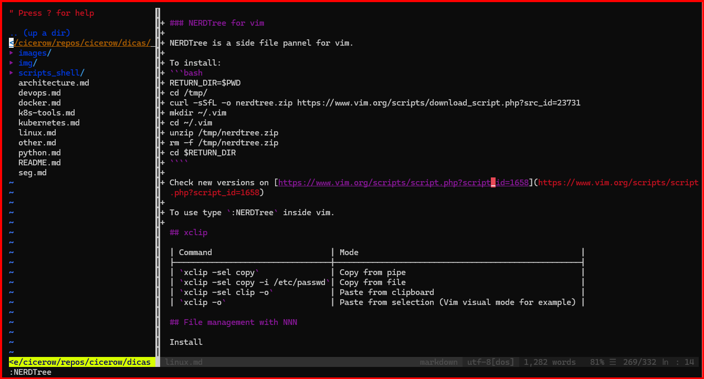
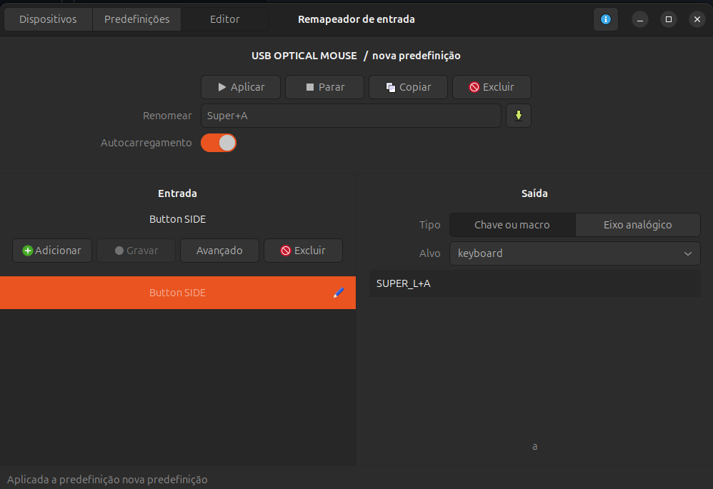

## Sudo without password
> **ATTENTION:** This is not recommended for production environments or applications with complex security requirements. Use only in test environment. 

To use sudo without password edit the file `/etc/sudoers` and change last line:

```bash
%sudo   ALL=(ALL:ALL) NOPASSWD:ALL
```

Change it automatically with the following command:

```bash
NEW_SUDO_FILE=$(sed 's/%sudo\tALL=(ALL:ALL) ALL/%sudo\tALL=(ALL:ALL) NOPASSWD:ALL/' /etc/sudoers)
sudo mv /etc/sudoers /etc/sudoers.original
echo "$NEW_SUDO_FILE" | tee /etc/sudoers
```

## Common command line apps

```bash
APPLICATIONS="curl wget git netcat tree jq tmux python3 python3-pip zip unzip openssl bc netcat s3fs tree dialog gping"
VIM_COMPONENTS="vim-fugitive vim-snippets vim-solarized vim-subtitles vim-gui-common vim-syntax-gtk vim-vimerl vim vim-gtk3 vim-git-hub vim-common vim-airline-themes vim-youcompleteme vim-athena vim-ale vim-redact-pass vim-doc vim-migemo vim-autopep8 vim-nox vim-addon-mw-utils vim-latexsuite vim-tjp vim-textobj-user vim-rails vim-scripts vim-syntastic vim-command-t vim-ctrlp vim-tiny vim-bitbake vim-python-jedi vim-lastplace vim-vader vim-khuno vim-icinga2 vim-runtime vim-tabular vim-ledger vim-pathogen vim-airline vim-vimerl-syntax vim-vimerl-syntax vim-poke vim-puppet vim-addon-manager vim-julia vim-voom vim-haproxy vim-vimerl vim-vimerl-syntax vim vim-common vim-runtime vim-tiny"
sudo apt update
sudo apt install -y $APPLICATIONS $VIM_COMPONENTS
# YAML Query
VERSION=v4.2.0 BINARY=yq_linux_amd64; \
    sudo wget https://github.com/mikefarah/yq/releases/download/${VERSION}/${BINARY} \
    -O /usr/local/bin/yq && sudo chmod +x /usr/local/bin/yq
```

## Graphical apps

```bash
XSERVER_APPLICATIONS="geany terminator xclip"
sudo apt update
sudo apt install -y $XSERVER_APPLICATIONS
echo "MIN Browser"
MIN_VERSION='1.27.0'
MIN_ARCHITECTURE='amd64'
wget https://github.com/minbrowser/min/releases/download/v1.27.0/min-$MIN_VERSION-$MIN_ARCHITECTURE.deb
sudo dpkg -i min-$MIN_VERSION-$MIN_ARCHITECTURE.deb
sudo apt install -f
```

## Prompt Linux

```bash
if [ "$color_prompt" = yes ]; then
  update_ps1() {
    GIT="$(if ls .git/HEAD >/dev/null 2>/dev/null; then echo -n ' ((GIT)) '$(<.git/HEAD); echo -n ' >>> '; fi)"
    ADD=""
    if test -n "$GIT"
    then
      ADD="\[\033[47;34m\]$GIT\[\033[00m\]"'\n'"$ADD"
    fi
    PS1="$ADD""$VIRTUAL_ENV_PROMPT"'${debian_chroot:+($debian_chroot)}\[\033[01;107;34m\] \u \[\033[01;44;37m\] \h \[\033[01;107;34m\] \w \[\033[00m\]\n==>\$ '
  }
  PROMPT_COMMAND=update_ps1
  PS1="$PROMPT_COMMAND"
  #PS1='${debian_chroot:+($debian_chroot)}\[\033[01;107;34m\] \u \[\033[01;44;37m\] \h \[\033[01;107;34m\] \w \[\033[00m\]\$ '
else
  PS1='${debian_chroot:+($debian_chroot)}\u@\h:\w\$ '
fi
```

## SSH in Docker

Create keys

```bash
ssh-keygen -P "" -t rsa  -b 4096 -C "root@server.local"    -f ansible_root_rsa_key
ssh-keygen -P "" -t rsa  -b 4096 -C "cicerow@server.local" -f ansible_cicerow_rsa_key
```

Create Dockerfile

```bash
echo 'FROM  debian:11.7
ENV   DEBIAN_FRONTEND=noninteractive
RUN   apt-get update && \
      apt-get install -y openssh-server && \
      apt-get clean
RUN   adduser --home /home/cicerow --uid 1201 cicerow
RUN   mkdir -p /run/sshd && \
      mkdir -p /root/.ssh 
COPY  ansible_root_rsa_key.pub /root/.ssh/authorized_keys
COPY  ansible_cicerow_rsa_key.pub /home/cicerow/.ssh/authorized_keys
CMD   /usr/sbin/sshd -D -4 -p 22 -f /etc/ssh/sshd_config
' > Dockerfile
```

Create container

```bash
docker build -t ansible-srv .
docker run -d --name ansible-srv-1 --hostname ansible-srv-1 ansible-srv
SRV_IP=$(docker inspect ansible-srv-1|grep '"IPAddress"'|head -n1|tr -d '" ,'|cut -d":" -f2)
```

Access via SSH

```bash
ssh -o "StrictHostKeyChecking no" -i ansible_root_rsa_key root@"$SRV_IP"
ssh -o "StrictHostKeyChecking no" -i ansible_cicerow_rsa_key cicerow@"$SRV_IP"
```

Check script in [scripts_shell/create-server-docker.sh](scripts_shell/create-server-docker.sh).
## Netcat Web Server

Your browser can make more than one connection at same time (parallel connections). The connections_count variable reflects each individual connection from the browser (no persistent connections).

Tested in WSL Ubuntu 22.04.

In debian:12.0 container, package name is **netcat-openbsd**. The package netcat-traditional does not support -W option (upper case).

```bash
connections_count=0
while true
do 
  connections_count=$(($connections_count + 1))
  response="HTTP/1.1 200 OK\r\nServer: netcat\r\n\r\n<h1>Netcat Web Server</h1>Using net cat as web server.<br>Connections: $connections_count<br>Server date: $(date)"
  echo -e -n $response|nc -W 1 -l 0.0.0.0 8080
done
```

## Tmux tips and tricks

File panel

```bash
watch -n 1 --no-title "echo $PWD;echo $(printf '%*s' "$COLUMNS" '' | tr ' ' '-');tree -a -I .git -L 2 --noreport"
```

Inside tumx, execute a command in a new window

```bash
tmux new-window vim ~/.bashrc
```

Copy mode

```bash
Roll text:                       pfx + PageUp (Esc to cancel)
Select text:                     Ctrl+space - arrows
Clean selection                  Ctrl+G
Copy selection / exit copy mode: Alt+w
Paste selection:                 pfx + ]
Search:                          Ctrl+s <term> <enter> / n (to next)
```

Synch panels

```bash
pfx + : setw synch on
pfx + : setw synch off
```

Edit buffer size

```bash
echo "set-option -g history-limit 10000" > ~/.tmux.conf
```

Style options inside `~/.tmux.conf`

```bash
set-option -g status-right ""                    # clear status information
set-option -g status-bg blue                     # change bottom bar color
set-option -g pane-active-border-style fg=blue   # change line color
set-option -g pane-border-style fg=grey          # change line color
```

Fix colors inside Tmux

```bash
export TERM=screen-256color-bce
```

## Nano tips and tricks

Many files in sambe window

```bash
Next:     Alt + . OR Alt + left arrow
Previous: Alt + , OR Alt + right arrow
```

Insert a new file in current window

```bash
Ctrl + R / Alt + F / [FILE NAME]
```

Insert a command result

```bash
Ctrl + T / [COMMAND]
```

## Vim Tips and tricks

Solve the home/end key error:

```bash
export TERM=xterm-256color
```

Deactivate auto indent:

```bash
#Linux or WSL:
echo '
set noautoindent
set nosmartindent
set nocindent
filetype indent off
' >> ~/.vimrc
```

```bash
# Mac with neovim/nvim:
mkdir ~/.config/nvim/
echo '
set noautoindent
set nosmartindent
set nocindent
filetype indent off
' >> ~/.config/nvim/init.vim
```

Disable mouse:

```bash
#Linux or WSL:
echo '
set mouse=
' >> ~/.vimrc
```

```bash
# Mac with neovim/nvim:
mkdir ~/.config/nvim/
echo '
set mouse=
' >> ~/.config/nvim/init.vim
```

| Action               | Mode |Command/Shortcut      |
|----------------------|------|----------------------|
| Open other file      | [N]  |`:e path/file.txt`    |
| List open files      | [N]  |`:ls`                 |
| Choose other file    | [N]  |`:b2`                 |
| Close current file   | [N]  |`:bd`                 |
| Undo last action     | [N]  |`:u`                  |
| Undo X actions       | [N]  |`:3u`                 |
| Line numbers         | [N]  |`:set number`         |
| Line numbers off     | [N]  |`:set nonumber`       |
| Go to line X         | [N]  |`:100`                |
| Replace in file      | [N]  |`%s/wrong/right/`     |
| Replace confirm      | [N]  |`%s/wrong/right/gc`   |
| Replace ignore case  | [N]  |`%s/wrong/right/gi`   |
| Replace in lines     | [N]  |`10,20s/wrong/right/` |
| Comment lines with # | [N]  |`5,10s/^/#/`          |
| Uncomment lines      | [N]  |`5,10s/^#//`          |
| Check registers      | [N]  |`:reg`                |
| File navigation      | [N]  |`:Explore`            |
| File navigation      | [N]  |`:e .`                |
| File navigation      | [N]  |`:e ~/.config`        |

| Mark | Meaning   |
|------|-----------|
| `[+]`| Changed   |
| `[-]`| Read only |
| `[*]`| Changed   |
| `[%]`| Swap file |

### NERDTree for vim

NERDTree is a side file pannel for vim.

To install:
```bash
RETURN_DIR=$PWD
cd /tmp/
curl -sSfL -o nerdtree.zip https://www.vim.org/scripts/download_script.php?src_id=23731
mkdir ~/.vim
cd ~/.vim
unzip /tmp/nerdtree.zip
rm -f /tmp/nerdtree.zip
cd $RETURN_DIR
````

Check new versions on [https://www.vim.org/scripts/script.php?script_id=1658](https://www.vim.org/scripts/script.php?script_id=1658)

To use type `:NERDTree` inside vim.



| Command   | Mode               |
|-----------|--------------------|
| `m`       | file menu: create, delete, move...|
| `q`       | exit panel         |
| `Ctrl+w p`| change panel       |
| `Ctrl+w w`| change panel       |
| `:bnext`  | next open file     |
| `:bprev`  | previous open file |

Use this command to map `:bprev` to `Ctrl+a` and `:bnext` to `Ctrl+d` and F2 to show/hide NERDTree:

```bash
echo 'nnoremap <C-A> :bprev<CR>
nnoremap <C-D> :bnext<CR>
nnoremap <F2> :NERDTreeToggle<CR>' >> ~/.vimrc
```

# Bash vi mode

Activate: `set -o vi`

| Action                 | Mode |Command/Shortcut      |
|------------------------|------|----------------------|
| Find next letter (x)   | [N]  | `fx`                 |
| Find next (after)      | [N]  | `;`                  |
| Find previous letter   | [N]  | `Fx`                 |
| Find next (after)      | [N]  | `;`                  |
| Copy current word      | [N]  | `y`                  |
| Copy until end of line | [N]  | `Y`                  |
| Copy two words         | [N]  | `y2w`                |
| Paste copied text      | [N]  | `P` or `p`           |
| Change word case       | [N]  | `~` (double depending of keboard) |
| Delete line            | [N]  | `D` or `dd`          |
| Search last command    | [N]  | `/-n istio-system`   |
| Repeat last vi command | [N]  | `.`                  |
| Open vi or vim to edit command | [N]  | `v`        |

- [https://dev.to/brandonwallace/how-to-use-vim-mode-on-the-command-line-in-bash-fnn](https://dev.to/brandonwallace/how-to-use-vim-mode-on-the-command-line-in-bash-fnn)
- [https://www.gnu.org/software/bash/manual/html_node/Readline-vi-Mode.html](https://www.gnu.org/software/bash/manual/html_node/Readline-vi-Mode.html)

## Fresh text editor

This is the best text editor now a days.

Download from GitHub (check other versions):
[https://github.com/sinelaw/fresh/releases/download/v0.1.44/fresh-editor_0.1.44-1_amd64.deb](https://github.com/sinelaw/fresh/releases/download/v0.1.44/fresh-editor_0.1.44-1_amd64.deb)

Install: `sudo dpkg -i fresh-editor_*.deb`

Usage: `fresh .` 

- You can use the VSCode shortcuts (View > Keybinding Style > VSCode).
- `Alt+Key` to access menus. `Shift` to select and common copy, cut, and paste shortcuts including undo and redo.
- Press `Ctrl+p` for command palette and `Shift+F1` to shortcut list.
- You can disable or enable mouse support.
- Check how to enable [LSP integration](https://github.com/sinelaw/fresh/blob/master/docs/USER_GUIDE.md#lsp-integration).

## xclip

| Command                         | Mode                                               |
|---------------------------------|----------------------------------------------------|
| `xclip -sel copy`               | Copy from pipe                                     |
| `xclip -sel copy -i /etc/passwd`| Copy from file                                     |
| `xclip -sel clip -o`            | Paste from clipboard                               |
| `xclip -o`                      | Paste from selection (Vim visual mode for example) |

## xargs

- Number of items proccessed per turn:
  - `echo {01..09} | xargs -n2 echo`
  - Prints 2 items per line.
- Placeholder for item:
  - `echo cicerow | xargs -I {} echo "I am {}, owner of this repo."`
  - `echo cicerow | xargs -I PLACEHOLDER echo "I am PLACEHOLDER, owner of this repo."`
  - The `-n` and `-I` are mutually exclusive. You can use two commands:
  - `echo {01..09} | xargs -n1 | xargs -I {} echo 'VALUE=USD${}.00'`

## File management with NNN

Install

```bash
apt install nnn
```

```bash
brew install nnn
```

| CLI options | Meaning             |
|-------------|---------------------|
| `-C`        | 8-color scheme      |
| `-d`        | Detail mode         |
| `-U`        | Show user and group |
| `-i`        | Show file type      |

| Key options | Meaning                         |
|-------------|---------------------------------|
| `q`         | Exit                            |
| `1` to `4`  | Change panel                    |
| `e`         | Edit file                       |
| `.`         | Show dot files                  |
| `f`         | Show details                    |
| `d`         | Detail mode                     |
| `/`         | Filter                          |
| `n`         | New file, dir or link           |
| `Ctrl+R`    | Rename file                     |
| `r`         | Rename files (batch)            |
| `>`         | Export file list                |
| `Space`     | Select files for operations [*] |
| `Ctrl+X`    | Exclude file (confirm) *        |
| `p`         | Copy selected here *            |
| `v`         | Move selected here *            |
| `!`         | Open sub shell (type exit to return)      |
| `t`         | Sort (c=clear, d=size, t=time, r=reverse) |

## Input Remapper

```bash
sudo apt install input-remmaper
```

Change shortcuts and mouse buttons. For example, change the side button to see open windows:



## Terminator

| Key options           | Meaning                         |
|-----------------------|---------------------------------|
| `Ctrl+Shift+T`        | New Tab                         |
| `Ctrl+PageUp/PageDown`| Switch Tabs                     |
| `Ctrl+Shift+Plus`     | Increase Font Size              |
| `Ctrl+Minus`          | Decrease Font Size              |
| `Ctrl+Shift+E`        | Horizontal Split (vertical line)|
| `Ctrl+Shift+O`        | Vertical Split (horizontal line)|
| `Ctrl+Shift+Arrows`   | Resize Pane                     |
| `Alt+Arrows`          | Switch Between Panes            |
| `Super+G`             | Group Panes                     |
| `Super+Shift+G`       | Ungroup Panes                   |
| `Ctrl+Shift+Z`        | Zoom                            |
| `Ctrl+Shift+F`        | Search Buffer                   |

Mark `Profiles > General > Copy on selection` to copy last item searched.

# Bash flock

- The `flock` is a command to create logs based in a file.
- To lock a file: `flock -x /tmp/scpt1.lock -c 'sleep 10' `
  - Use `-x` or `-e` for exclusive.
  - Always use a command (`-c` option).
  - During the command, all other instances of `flock` will wait to execute command.
- Test case! Paste all commands once in terminal:
```bash
echo > /tmp/test_file.lock
( flock -x  /tmp/test_file.lock -c 'sleep 2'; echo 1st=$? ) &
( flock -xn /tmp/test_file.lock -c 'sleep 2'; echo 2nd=$? ) &
echo Finish.
```
- The first `flock` command works (`1st=0`) because it executes first and locks the file for 2 seconds.
- The last `flock` command fails (`2nd=1`) because when it runs, the first `flock` still running locking the file and counting 2 seconds.
- The `-n` used in the last command is a non-blocking option. It fails if the lock fail instead wait to execute the command.
- Try it with many commands:
```bash
( flock -x  /tmp/test_file.lock -c 'sleep 2'; echo 1st=$? ) &
( flock -xn /tmp/test_file.lock -c 'sleep 2'; echo 2nd=$? ) &
( flock -xn /tmp/test_file.lock -c 'sleep 2'; echo 3rd=$? ) &
( flock -xn /tmp/test_file.lock -c 'sleep 2'; echo 4th=$? ) &
( flock -xn /tmp/test_file.lock -c 'sleep 2'; echo 5th=$? ) &
( flock -xn /tmp/test_file.lock -c 'sleep 2'; echo 6th=$? ) &
```
- The first will run and all the others will fail.
- Try it without `-n` option.
```bash
( flock -x /tmp/test_file.lock -c 'sleep 2'; echo 1st=$? ) &
( flock -x /tmp/test_file.lock -c 'sleep 2'; echo 2nd=$? ) &
( flock -x /tmp/test_file.lock -c 'sleep 2'; echo 3rd=$? ) &
( flock -x /tmp/test_file.lock -c 'sleep 2'; echo 4th=$? ) &
( flock -x /tmp/test_file.lock -c 'sleep 2'; echo 5th=$? ) &
( flock -x /tmp/test_file.lock -c 'sleep 2'; echo 6th=$? ) &
```
- All of them will wait 2 seconds and run properly.
- > Note: the `echo` command is outside the critical section and shows the result of `flock` not the command in `-c` option.
